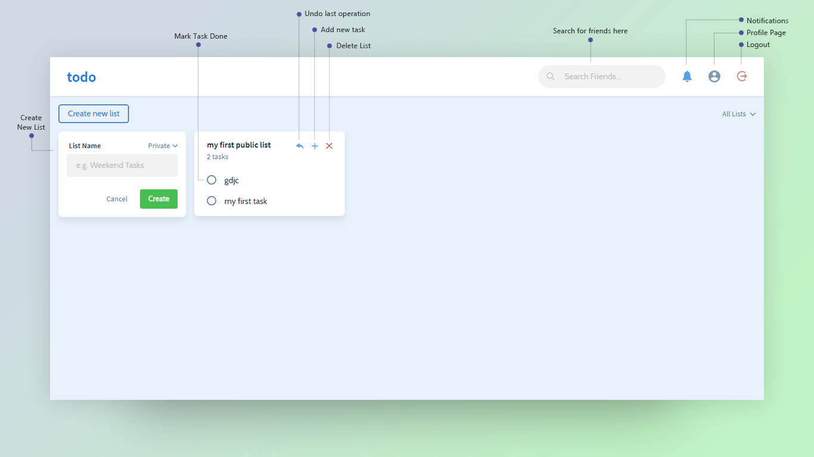

# Todo List Manager

A web app where you can create and manage todo lists. It also has the feature to collaborate public task lists with friends.

[Click here](http://todo.anishghosh.me) to check the app.

### Screenshot



### Built With
* Angular 5 & Bootstrap 4 - Frontend
* Node.js & Express.js - Backend
* MongoDB - Database
* Socket.IO

### Prerequisites
1. MongoDB
2. Node.js

### Running the App

The steps you need to follow (assuming MongoDB is running):

```shell
git clone https://github.com/anishghosh103/todo-app.git
cd todo-app/server
npm install
node server
```
